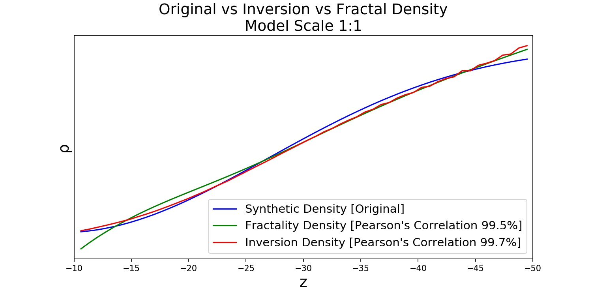
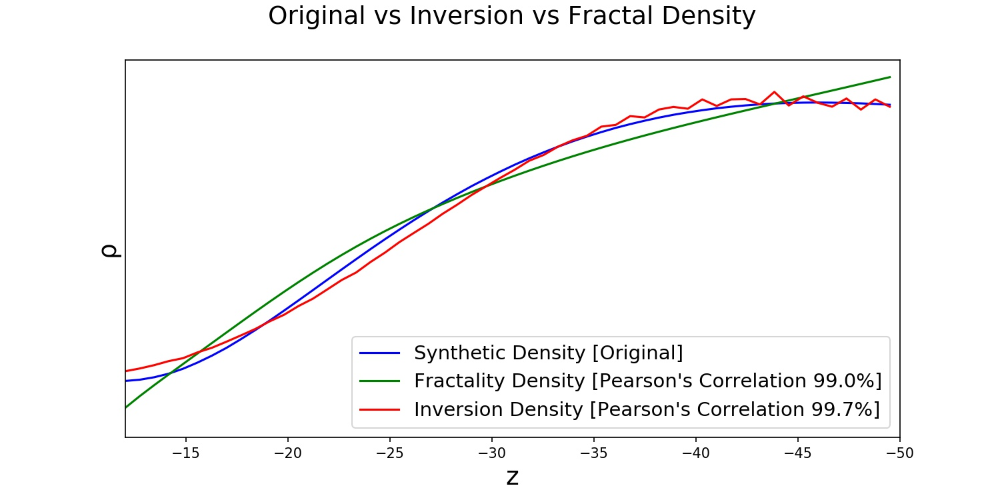
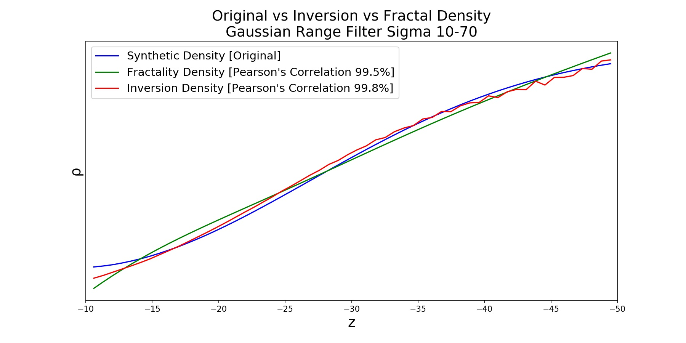
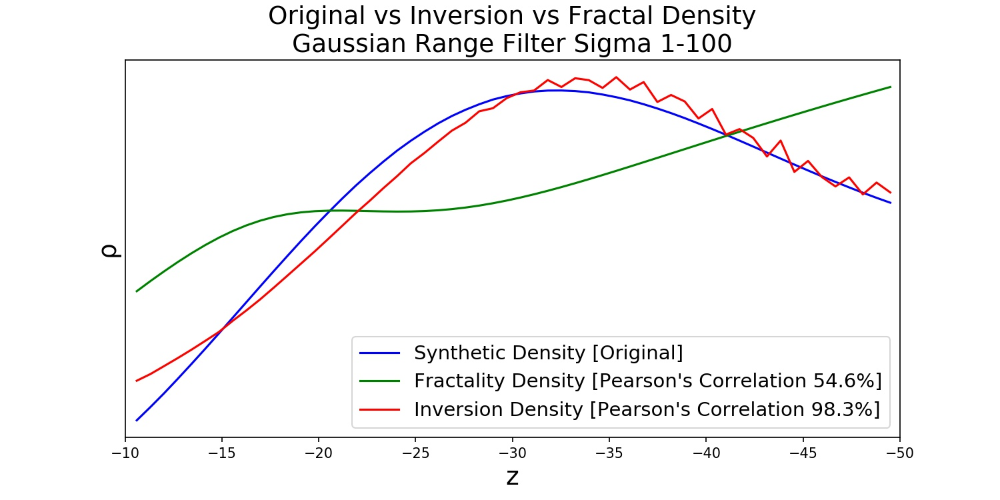
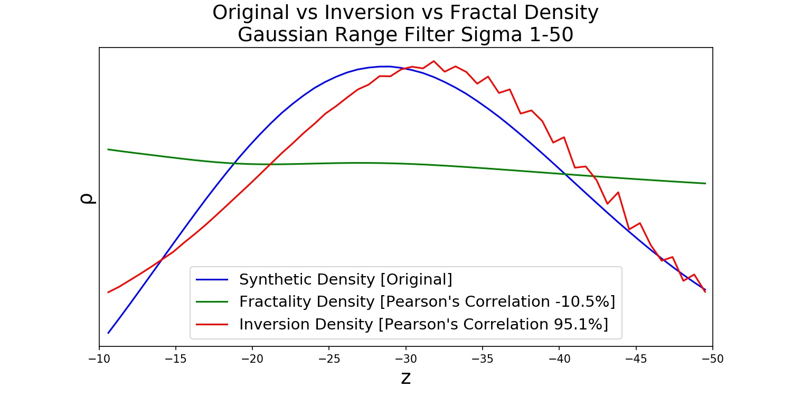

## 3D Density Inversion Methods by Circular Hough Transform [Focal Average] and Fractality Index

Geophysical density inversion methods based on Circular Hough Transform (also known as Focal Average in GIS packages
like to ESRI products) and Fractality Index calculated by discrete spatial power spectrum of gravity on synthetic models:

 * basic linear density depth profile model [basic.ipynb](basic.ipynb) The model also illustrates source gravity grid decimation to estimate the accuracy for real-world gravity grids processing.
 
 
 * more realistic quasi-linear density depth profile model [model.ipynb](model.ipynb) The model includes synthetic density filtering by narrow Gaussian range filter and the same inversion processing as the basic model.
 * 
 
 * robust linear density depth profile model with noise reduction [Gaussian.ipynb](Gaussian.ipynb) The model works better for real-world data because Gaussian filtering (with range 10-70 units here) eliminates high frequency (low wavelenght) noise and supresses effects of too small (<10 units) and too large objects (>70 units). Thats equals to geological scale selection. 

 * robust non-linear density-depth profile models [Gaussian2.ipynb](Gaussian2.ipynb) and [Gaussian3.ipynb](Gaussian3.ipynb)
 
 
 
 There are two ways: use piecewise approximation (split depth to set of ranges where density is constant approximated) and (quasi)linear density inversion for the each piece or use non-linear density inversion by Gaussian wave range filter for 2D gravity surface field.
 The fractality density is linear or step function only. Nonetheless, we still able to estimate average density for complex density profiles.
 To select the best gaussian filter parameters, define suitable geologic scale for model or see heuristical and machine learning approaches to do it.
