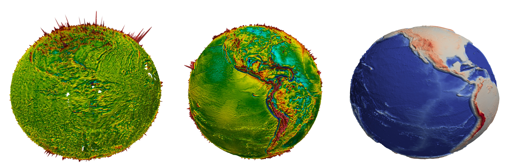

## 3D Earth Observation Data Visualization



See also https://www.linkedin.com/pulse/3d-earth-observation-data-processing-structural-alexey-pechnikov/?published=t

These are our commonly used datasets:

  * EMAG2 Earth Magnetic Anomaly Grid,
  * Sandwell and Smith Free Air Gravity,
  * GEBCO Gridded Bathymetry Data.
  
That's very helpful to produce a high-quality visualization for each of them to present our projects results. ParaView is the right tool to do it and we need to prepare the source data.

### Prepare data files

The original data grids are too large and that's better to reduce the sizes. Also, only NetCDF files can be easy processed in ParaView by this way and so we convert the datasets to this format too.

```
gdal_translate -of NetCDF -r average -tr .25 0.25 EMAG2_V2.tif EMAG2_V2.15min.nc
gdal_translate -of NetCDF -r average -tr .25 0.25 grav_28.1.nc grav_28.1.15min.nc
gdal_translate -of NetCDF -r average -tr .25 0.25 GEBCO_2019.nc GEBCO_2019.15min.nc 
```

### ParaView calculator expression for spherical coordinates conversion

We use unit sphere although we can use sphere with the right Earth's radius too.  

```
(1 + (VARIABLE/6370000) * SCALE)* ( iHat * cos(asin(coordsZ)) * cos(atan(coordsY/coordsX)) * coordsX/abs(coordsX) + jHat * cos(asin(coordsZ)) * sin(atan(coordsY/coordsX)) * coordsX/abs(coordsX) + kHat * coordsZ)
```

Here VARIABLE is "z" axis value and SCALE is vertical scale factor for better visualization.
