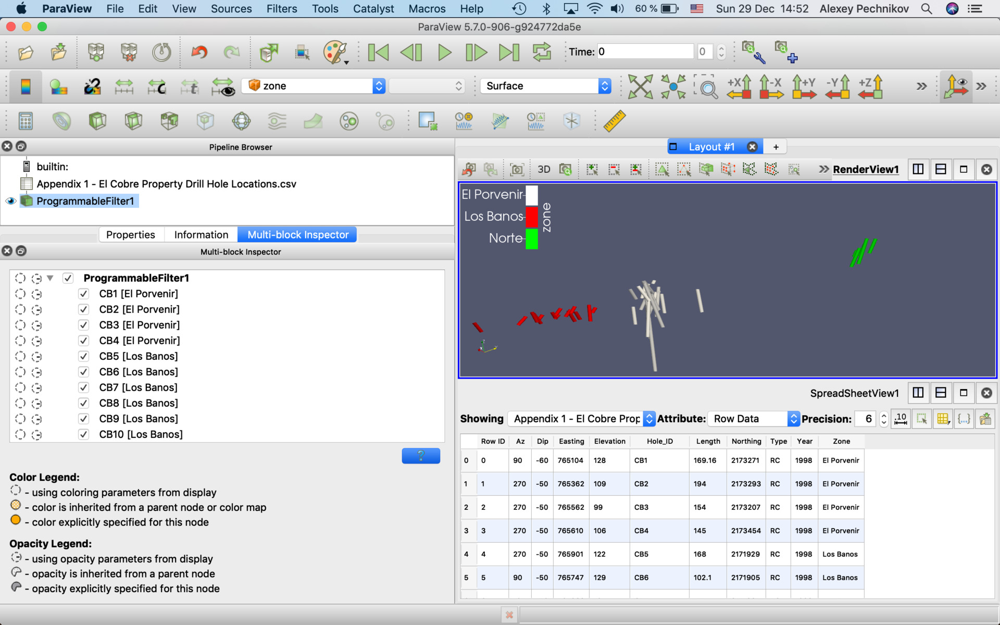

# How to load data into ParaView using it's ProgrammableFilter data source

There are some different ways to enhance ParaView features by custom Python code:

1. Use Python console (the best way for one-time commands which are outside of the processing pipeline),
2. Use Programmable Source (the best way for custom code without pipeline input and the complete processing pipeline),
3. Use Programmable Filter (the best way for custom code with pipeline input and the complete processing pipeline),
4. Use Plugins (the best way for well formalized code modules).

Below use explaining the way #3. In this case we use Python code with is integrated into ParaView processing pipeline and it's depends of the other pipeline objects. Way #2 is very similar but it's not depends of other pipeline items.

## Install Python modules

Follow instructions to install Python 2.7 and configure PYTHONPATH environment variable as this article describing:
https://www.linkedin.com/pulse/paraview-pvgeo-plugins-howto-alexey-pechnikov/

Install additional Python 2.7 modules required for the code below:
```
pip2.7 install numpy xarray pandas geopandas shapely vtk h5py
```

## Prepare data files

Some data files required from ParaView project for geological exploration on El Cobre Property, Veracruz, Mexico and ParaView project for geological exploration on Mosha fault area, North Iran. Download the files by the links and place them to paths in the code below or change the paths in the code for your data file locations.

(1) https://github.com/mobigroup/ParaView-ElCobreMexico/blob/master/data/ALOS/ALOS_AW3D30_v1903.subset.32614.30m.tif

(2) https://github.com/mobigroup/ParaView-ElCobreMexico/blob/master/data/Appendix%201%20-%20El%20Cobre%20Property%20Drill%20Hole%20Locations.csv

(3) aoi_cobra.32614.shp see here https://github.com/mobigroup/ParaView-ElCobreMexico/tree/master/data/aoi_cobra

(4) https://github.com/mobigroup/ParaView-MoshaFault/blob/master/data/GEBCO_2019/GEBCO_2019.subset.32639.0.5km.tif

(5) Damavand.shp see here https://github.com/mobigroup/ParaView-MoshaFault/tree/master/data/volcano

## vtkMultiblockDataSet

Before we can launch the filter we need to create ParaView Table from EPSG:32614 drill locations CSV (2).

"RequestInformation Script" and "RequestUpdateExtent Script" are not required for vtkMultiblockDataSet output.

### vtkMultiblockDataSet (process EPSG:32614 drill locations from ParaView Table)

For better visialization turn on "Render Lines as Tubes" checkbox and set "Line Width" equal to 10.

#### Script
```
import vtk
import numpy as np
import pandas as pd

vtk_table = self.GetTableInput()
# table headers
cols = []
for icol in range( vtk_table.GetNumberOfColumns() ):
    name = vtk_table.GetColumn(icol).GetName()
    cols.append( name )

values = []
for irow in range(vtk_table.GetNumberOfRows()):
    _values = []
    for icol in range( vtk_table.GetNumberOfColumns() ):
        val = vtk_table.GetColumn(icol).GetValue(irow)
        _values.append(val)
    values.append(_values)

df = pd.DataFrame.from_records(values, columns=cols)
#print (df)

# rename columns to easy use
df = df.rename(columns={'Easting': 'x','Northing':'y','Elevation':'z'})

# https://en.wikipedia.org/wiki/Spherical_coordinate_system
# Spherical coordinates (r, θ, φ) as often used in mathematics:
# radial distance r, azimuthal angle θ, and polar angle φ. 
df['theta'] = 1./2*math.pi - math.pi*df.Az/180
df['phi'] = math.pi*(90 - df.Dip)/180
# 1st point
df['dx'] = np.round(df.Length*np.sin(df.phi)*np.cos(df.theta))
df['dy'] = np.round(df.Length*np.sin(df.phi)*np.sin(df.theta))
df['dz'] = np.round(df.Length*np.cos(df.phi))
# 2nd point
df['x2'] = df.x + df.dx
df['y2'] = df.y + df.dy
df['z2'] = df.z + df.dz
# label
df['label'] = df.Hole_ID + ' [' + df.Zone + ']'

# get output tkMultiBlockDataSet()
print ("output",self.GetOutput().IsA("vtkMultiBlockDataSet"))
mb = self.GetOutput()
mb.SetNumberOfBlocks(len(df))

for idx,well in df.iterrows():
    #print (idx,well)
    
    points = vtk.vtkPoints()
    points.SetNumberOfPoints(2)
    points.SetPoint(0, well['x'],well['y'],well['z'])
    points.SetPoint(1, well['x2'],well['y2'],well['z2'])
    
    lines = vtk.vtkCellArray()
    lines.InsertNextCell(2)
    lines.InsertCellPoint(0)
    lines.InsertCellPoint(1)
    
    polyData = vtk.vtkPolyData()
    polyData.SetPoints(points)
    polyData.SetLines(lines)

    time = vtk.vtkFloatArray()
    time.SetNumberOfComponents(1)
    time.SetName("year");
    time.InsertNextValue(well.Year)
    polyData.GetCellData().AddArray(time)
    
    zone = vtk.vtkStringArray()
    zone.SetNumberOfComponents(1)
    zone.SetName("zone")
    zone.InsertNextValue(well.Zone)
    polyData.GetCellData().AddArray(zone)

    wtype = vtk.vtkStringArray()
    wtype.SetNumberOfComponents(1)
    wtype.SetName("type")
    wtype.InsertNextValue(well.Type)
    polyData.GetCellData().AddArray(wtype)
    
    # add to multiblock dataset
    mb.SetBlock( idx, polyData )
    mb.GetMetaData( idx ).Set( vtk.vtkCompositeDataSet.NAME(), well['label'] )
```


## References

[1] https://www.paraview.org/Wiki/Python_Programmable_Filter

[2] https://stackoverflow.com/questions/7666981/how-to-set-data-values-on-a-vtkstructuredgrid

[3] https://blog.kitware.com/developing-hdf5-readers-using-vtkpythonalgorithm/

[4] https://github.com/Kitware/VTK/blob/master/Examples/Infovis/Python/tables_adv.py

[5] https://gitlab.kitware.com/edf/vtk/blob/b606c86a5b3b3412f8e500e40b1de44537dd2135/Wrapping/Python/vtk/numpy_interface/dataset_adapter.py

[6] https://www.paraview.org/Wiki/Python_calculator_and_programmable_filter
