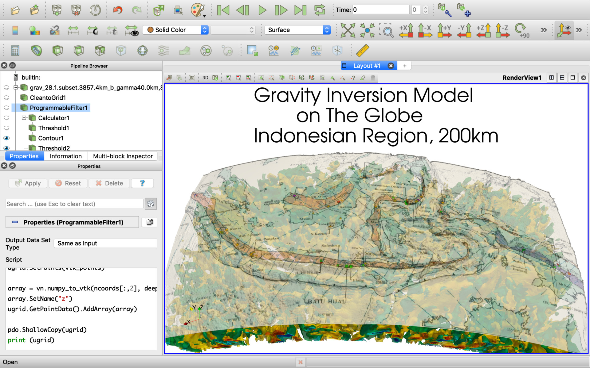

## How to load data into ParaView using it's ProgrammableFilter feature

There are some different ways to enhance ParaView features by custom Python code:

1. Use Python console (the best way for one-time commands which are outside of the processing pipeline),
2. Use [Programmable Source](../ProgrammableSource/README.md) (the best way for custom code without pipeline input and the complete processing pipeline),
3. Use [Programmable Filter](../ProgrammableFilter/README.md) (the best way for custom code with pipeline input and the complete processing pipeline),
4. Use Plugins (the best way for well formalized code modules).

Below use explaining the way #3. In this case we use Python code integrated into ParaView processing pipeline with dependencies to other pipeline objects. Way #2 is very similar but it's not depends of other pipeline items.

[Install Python modules](../install.md)

[Prepare data files](../datafiles.md)

[ProgrammableFilter vtkStructuredGrid](vtkStructuredGrid.md)

[ProgrammableFilter vtkMultiblockDataSet](vtkMultiblockDataSet.md)

[ProgrammableFilter vtkPolyData](vtkPolyData.md)

[References](../references.md)

## Complex scripts

This script can reproject Unstructured Grid.

```
import numpy as np
import geopandas as gpd
from shapely.geometry import Point
from vtk.util import numpy_support as vn
from vtk import vtkPoints, vtkUnstructuredGrid, VTK_FLOAT
import time

t0 = time.time()

pdi = self.GetInput()
pdo =  self.GetOutput()

ugrid = vtkUnstructuredGrid()
ugrid.DeepCopy(pdi)

coords = ugrid.GetPoints().GetData()
ncoords = vn.vtk_to_numpy(coords)
geom = gpd.GeoSeries(map(Point, zip(ncoords[:,0], ncoords[:,1], ncoords[:,2])))
geom.crs = {'init': 'epsg:3857'}
geom = geom.to_crs({'init': 'epsg:4326'})
print(geom.tail())

vtk_points = vtkPoints()
points = np.asarray([g.coords[0] for g in geom])
_points = vn.numpy_to_vtk(points, deep=True)
vtk_points.SetData(_points)

ugrid.SetPoints(vtk_points)

array = vn.numpy_to_vtk(ncoords[:,2], deep=True, array_type=VTK_FLOAT)
array.SetName("z")
ugrid.GetPointData().AddArray(array)

pdo.ShallowCopy(ugrid)
print (ugrid)

t1 = time.time()
print ("t1-t0", t1-t0)
```

