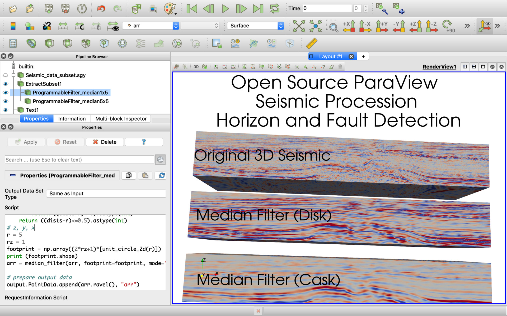

## vtkStructuredGrid

### vtkStructuredGrid (limit histogram filter for percentiles range 5...95)

#### Script
```
from vtk.util.numpy_support import vtk_to_numpy
import numpy as np

# get input data
vtk_arr = inputs[0].PointData['trace']
arr = vtk_to_numpy(vtk_arr)

# process
pcnt = np.nanpercentile(arr,[5,95])
arr2 = np.clip(arr,pcnt[0],pcnt[1])

# set output data
output.PointData.append(arr2, "arr")
```

### vtkStructuredGrid (IDW filter with degree=-2 and k=30 nearest neighbors)

#### Script
```
from vtk.util.numpy_support import vtk_to_numpy
import numpy as np
from scipy.spatial import cKDTree
from itertools import product

# prepare input data
print (inputs[0].GetDimensions())
vtk_arr = inputs[0].PointData['trace']
shape = inputs[0].GetDimensions()
arr = vtk_to_numpy(vtk_arr).reshape(shape[::-1])

# process
zs, ys, xs = shape

x, y, z = zip(*product(range(xs), range(ys), range(zs)))
xt = range(xs)
yt = range(ys)
zt = range(zs)

tree = cKDTree(list(zip(x, y, z)))

arr_idws = []
for x in xt:
    y, z = zip(*product(yt, zt))
    d, inds = tree.query(list(zip(len(y)*[x], y, z)), k = 30)
    # idw
    w = 1.0 / d[:,1:]**2
    arr_idw = np.nansum(w * arr.flatten()[inds[:,1:]], axis=1) / \
        (1e-10+np.nansum(w*(arr.flatten()[inds[:,1:]]/arr.flatten()[inds[:,1:]]), axis=1))
    arr_idw.shape = (len(yt), len(zt))
    arr_idws.append(arr_idw)
arr_idws = np.array(arr_idws)

# prepare output data
output.PointData.append(arr_idws.ravel(), "idw")
```

### vtkStructuredGrid (median filter)

#### Script
```
from vtk.util.numpy_support import vtk_to_numpy
import numpy as np
from scipy.ndimage.filters import median_filter

# prepare input data
print (inputs[0].GetDimensions())
vtk_arr = inputs[0].PointData['trace']
shape = inputs[0].GetDimensions()
arr = vtk_to_numpy(vtk_arr).reshape(shape[::-1])

# process
#arr[200:,:,:] = -10000
def unit_circle_2d(r):
    A = np.arange(-r,r+1)**2
    dists = np.sqrt( A[:,None] + A)
    # circle
    #return (np.abs(dists-r)<=0).astype(int)
    # filled circle
    if r <= 2:
        return ((dists-r)<=0).astype(int)
    return ((dists-r)<=0.5).astype(int)
# z, y, x
r = 5
rz = 1
footprint = np.array((2*rz+1)*[unit_circle_2d(r)])
print (footprint.shape)
arr = median_filter(arr, footprint=footprint, mode='nearest')

# prepare output data
output.PointData.append(arr.ravel(), "arr")
```

### vtkStructuredGrid (gaussian filter with different standard deviation (1,2,3) for z,y,x axes)

#### Script
```
from vtk.util.numpy_support import vtk_to_numpy
import numpy as np
from scipy.ndimage.filters import gaussian_filter

# prepare input data
print (inputs[0].GetDimensions())
vtk_arr = inputs[0].PointData['trace']
shape = inputs[0].GetDimensions()
arr = vtk_to_numpy(vtk_arr).reshape(shape[::-1])

arr = gaussian_filter(arr, (1,2,3), mode='nearest')

# prepare output data
output.PointData.append(arr.ravel(), "arr")
```


