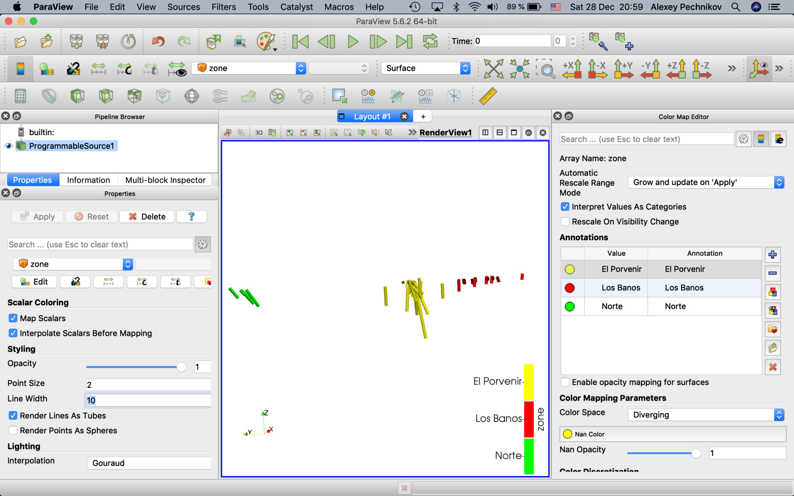
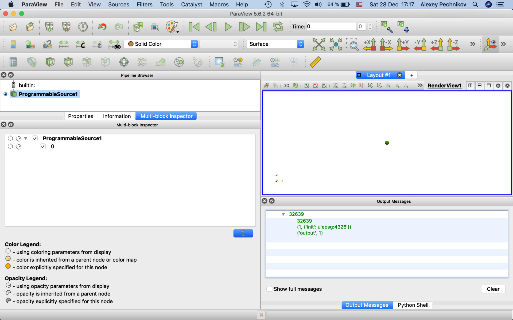
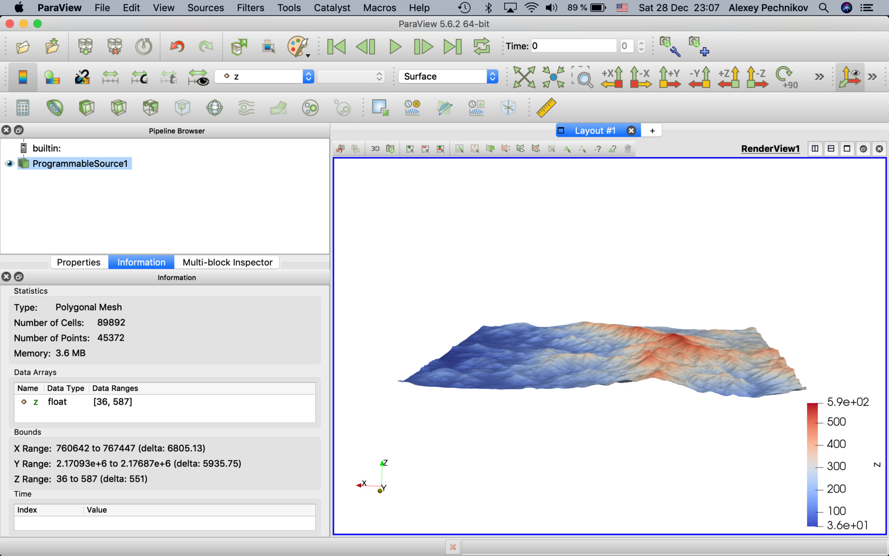
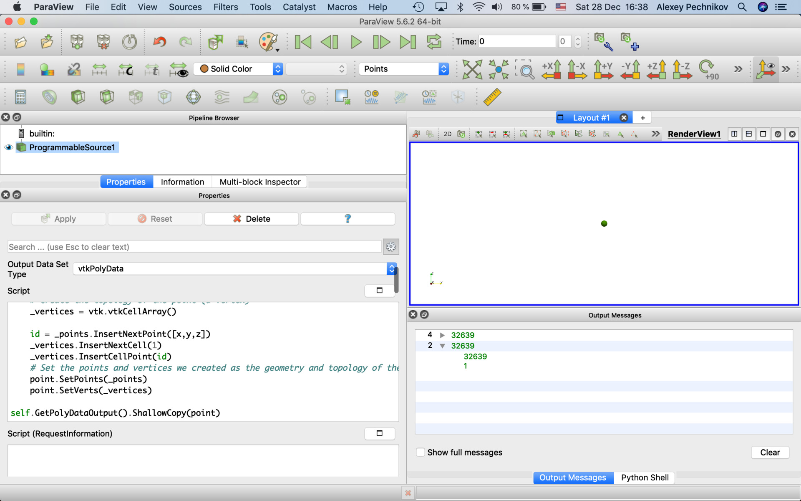
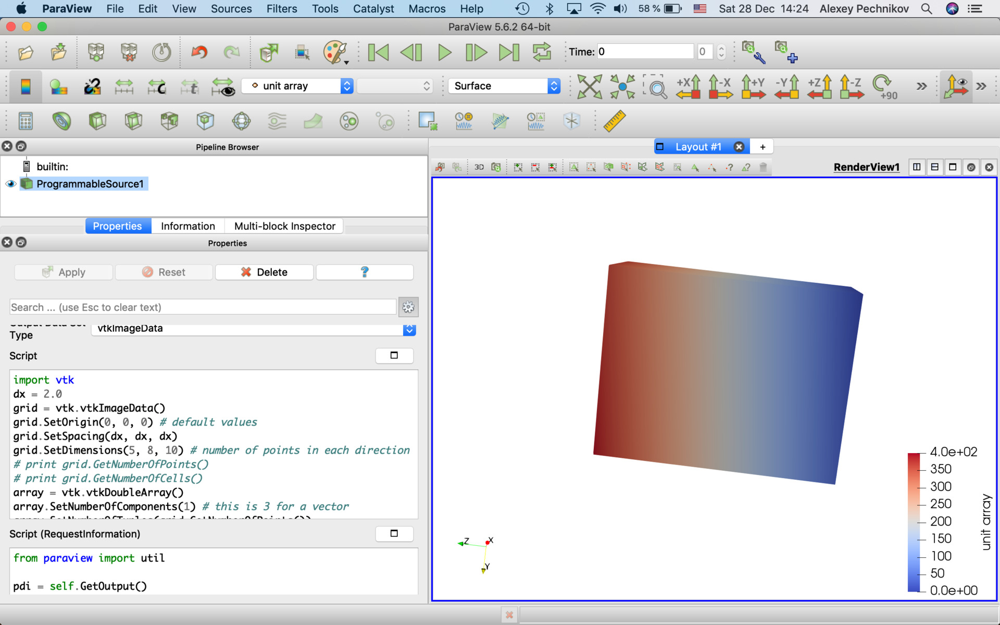
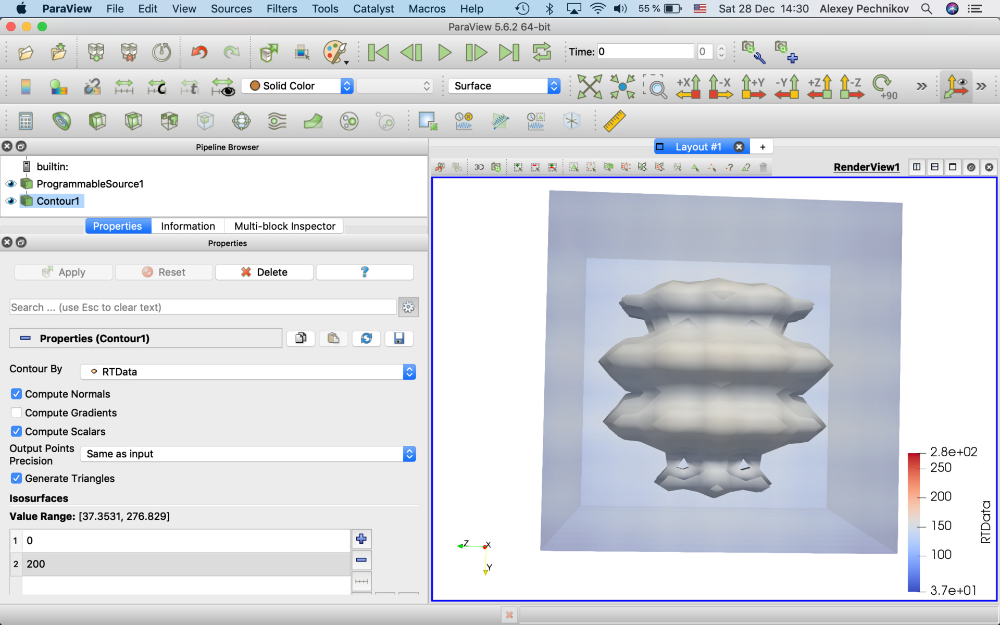

# How to load data into ParaView using it's ProgrammableSource data source

There are some different ways to enhance ParaView features by custom Python code:

1. Use Python console (the best way for one-time commands which are outside of the processing pipeline),
2. Use Programmable Source (the best way for custom code without pipeline input and the complete processing pipeline),
3. Use Programmable Filter (the best way for custom code with pipeline input and the complete processing pipeline),
4. Use Plugins (the best way for well formalized code modules).

Below use explaining the way #2. In this case we use Python code with is integrated into ParaView processing pipeline but it's not depends of the other pipeline objects. Way #3 is very similar but it depends of other pipeline items.

## Install Python modules

Follow instructions to install Python 2.7 and configure PYTHONPATH environment variable as this article describing:
https://www.linkedin.com/pulse/paraview-pvgeo-plugins-howto-alexey-pechnikov/

Install additional Python 2.7 modules required for the code below:
```
pip2.7 install numpy xarray pandas geopandas shapely vtk h5py
```

## Prepare data files

Some data files required from ParaView project for geological exploration on El Cobre Property, Veracruz, Mexico and ParaView project for geological exploration on Mosha fault area, North Iran. Download the files by the links and place them to paths in the code below or change the paths in the code for your data file locations.

(1) https://github.com/mobigroup/ParaView-ElCobreMexico/blob/master/data/ALOS/ALOS_AW3D30_v1903.subset.32614.30m.tif

(2) https://github.com/mobigroup/ParaView-ElCobreMexico/blob/master/data/Appendix%201%20-%20El%20Cobre%20Property%20Drill%20Hole%20Locations.csv

(3) aoi_cobra.32614.shp see here https://github.com/mobigroup/ParaView-ElCobreMexico/tree/master/data/aoi_cobra

(4) https://github.com/mobigroup/ParaView-MoshaFault/blob/master/data/GEBCO_2019/GEBCO_2019.subset.32639.0.5km.tif

(5) Damavand.shp see here https://github.com/mobigroup/ParaView-MoshaFault/tree/master/data/volcano

(6) data60.h5 generated as described in [3]

## vtkMultiblockDataSet

RequestInformation Script is not required for vtkMultiblockDataSet output.

### vtkMultiblockDataSet (read EPSG:32614 drill locations CSV and EPSG:32614 topography GeoTIFF)

For better visialization turn on "Render Lines as Tubes" checkbox and set "Line Width" equal to 10.

#### Script
```
import vtk
import numpy as np
import pandas as pd

CSV = "/Users/mbg/Documents/WELLS/Appendix 1 - El Cobre Property Drill Hole Locations.csv"

# read datafile and rename columns to easy use
df = pd.read_csv(CSV).rename(columns={'Easting': 'x','Northing':'y','Elevation':'z'})
# https://en.wikipedia.org/wiki/Spherical_coordinate_system
# Spherical coordinates (r, θ, φ) as often used in mathematics:
# radial distance r, azimuthal angle θ, and polar angle φ. 
df['theta'] = 1./2*math.pi - math.pi*df.Az/180
df['phi'] = math.pi*(90 - df.Dip)/180
# 1st point
df['dx'] = np.round(df.Length*np.sin(df.phi)*np.cos(df.theta))
df['dy'] = np.round(df.Length*np.sin(df.phi)*np.sin(df.theta))
df['dz'] = np.round(df.Length*np.cos(df.phi))
# 2nd point
df['x2'] = df.x + df.dx
df['y2'] = df.y + df.dy
df['z2'] = df.z + df.dz
# label
df['label'] = df.Hole_ID + ' [' + df.Zone + ']'

# get output tkMultiBlockDataSet()
print ("output",self.GetOutput().IsA("vtkMultiBlockDataSet"))
mb = self.GetOutput()
mb.SetNumberOfBlocks(len(df))

for idx,well in df.iterrows():
    #print (idx,well)
    
    points = vtk.vtkPoints()
    points.SetNumberOfPoints(2)
    points.SetPoint(0, well['x'],well['y'],well['z'])
    points.SetPoint(1, well['x2'],well['y2'],well['z2'])
    
    lines = vtk.vtkCellArray()
    lines.InsertNextCell(2)
    lines.InsertCellPoint(0)
    lines.InsertCellPoint(1)
    
    polyData = vtk.vtkPolyData()
    polyData.SetPoints(points)
    polyData.SetLines(lines)

    time = vtk.vtkFloatArray()
    time.SetNumberOfComponents(1)
    time.SetName("year");
    time.InsertNextValue(well.Year)
    polyData.GetCellData().AddArray(time)
    
    zone = vtk.vtkStringArray()
    zone.SetNumberOfComponents(1)
    zone.SetName("zone")
    zone.InsertNextValue(well.Zone)
    polyData.GetCellData().AddArray(zone)

    wtype = vtk.vtkStringArray()
    wtype.SetNumberOfComponents(1)
    wtype.SetName("type")
    wtype.InsertNextValue(well.Type)
    polyData.GetCellData().AddArray(wtype)
    
    # add to multiblock dataset
    mb.SetBlock( idx, polyData )
    mb.GetMetaData( idx ).Set( vtk.vtkCompositeDataSet.NAME(), well['label'] )
```


### vtkMultiblockDataSet (read WGS84 volcano shapefile and EPSG:32639 topography GeoTIFF)

For better visialization turn on "Render Points as Spheres" checkbox and set "Point Size" equal to 20.

#### Script
```
import vtk
import xarray as xr
import geopandas as gpd

SHP = "/Users/mbg/Documents/volcano/Damavand.shp"
DEM = "/Users/mbg/Documents/GEBCO_2019/GEBCO_2019.subset.32639.0.5km.tif"

dem = xr.open_rasterio(DEM)
epsg = int(dem.crs.split(':')[1])
print (epsg)

shp = gpd.read_file(SHP)
print (len(shp), shp.crs)

# Reproject if needed
if shp.crs == {}:
    # coordinate system is not defined, use WGS84 as default
    shp.crs = {'init': 'epsg:4326'}
shp['geometry'] = shp['geometry'].to_crs(epsg=epsg)

# get output tkMultiBlockDataSet()
print ("output",self.GetOutput().IsA("vtkMultiBlockDataSet"))
mb = self.GetOutput()
mb.SetNumberOfBlocks(len(shp))

for rowidx, row in shp.reset_index().iterrows():
    geom = row.geometry

    x = geom.x
    y = geom.y
    z = float(dem.sel(x=x,y=y,method='nearest'))

    # Create a polydata object
    point = vtk.vtkPolyData()

    # Create the geometry of a point (the coordinate)
    _points = vtk.vtkPoints()
    # Create the topology of the point (a vertex)
    _vertices = vtk.vtkCellArray()
    
    id = _points.InsertNextPoint([x,y,z])
    _vertices.InsertNextCell(1)
    _vertices.InsertCellPoint(id)
    # Set the points and vertices we created as the geometry and topology of the polydata
    point.SetPoints(_points)
    point.SetVerts(_vertices)

    mb.SetBlock( rowidx, point )
    mb.GetMetaData( rowidx ).Set( vtk.vtkCompositeDataSet.NAME(), str(rowidx) )
```


## vtkPolyData

RequestInformation Script is not required for vtkPolyData output.

### vtkPolyData (read EPSG:32639 AOI shapefile and EPSG:32639 topography GeoTIFF and convert only topography for the area to ParaView surface)

#### Script
```
import vtk
import numpy as np
import xarray as xr
import pandas as pd
import geopandas as gpd
import shapely as sp

SHP = "/Users/mbg/Documents/SHP/aoi_cobra.32614.shp"
DEM = "/Users/mbg/Documents/ALOS/ALOS_AW3D30_v1903.subset.32614.30m.tif"

# Load DEM
dem = xr.open_rasterio(DEM)
epsg = int(dem.crs.split(':')[1])
print (epsg)

# Load shapefile
shp = gpd.read_file(SHP)

# Reproject if needed
if shp.crs == {}:
    # coordinate system is not defined, use WGS84 as default
    shp.crs = {'init': 'epsg:4326'}
shp['geometry'] = shp['geometry'].to_crs(epsg=epsg)

# calculate 1st geometry extent
(minx, miny, maxx, maxy) = shp.loc[0,'geometry'].bounds
# create raster dataframe for the geometry extent only
df = dem.sel(x=slice(minx,maxx),y=slice(maxy,miny)).to_dataframe('z').reset_index()[['x','y','z']]

# create geodataframe from the raster
geometry = [sp.geometry.Point(x,y) for x,y in zip(df.x,df.y)]
gdf = gpd.GeoDataFrame([], crs=dem.crs, geometry=geometry)
# crop the raster geodataframe by the exact 1st geometry
df = df[gdf.intersects(shp.loc[0,'geometry'])]

points = vtk.vtkPoints()
for row in df.itertuples():
    points.InsertNextPoint(row.x, row.y, row.z)

aPolyData = vtk.vtkPolyData()
aPolyData.SetPoints(points)
aCellArray = vtk.vtkCellArray()
boundary = vtk.vtkPolyData()
print ("boundary",boundary)
boundary.SetPoints(aPolyData.GetPoints())
boundary.SetPolys(aCellArray)
delaunay = vtk.vtkDelaunay2D()
delaunay.SetTolerance(0.001)
delaunay.SetInputData(aPolyData)
delaunay.SetSourceData(boundary)

delaunay.Update()

outputPolyData = delaunay.GetOutput()
array = vtk.vtkFloatArray()
array.SetName("z");
for i in range(0, outputPolyData.GetNumberOfPoints()):
    array.InsertNextValue(outputPolyData.GetPoint(i)[2])
outputPolyData.GetPointData().SetScalars(array)

self.GetPolyDataOutput().ShallowCopy(outputPolyData)
```


### vtkPolyData (read EPSG:32639 topography GeoTIFF and convert to ParaView surface)

#### Script
```
import vtk
import numpy as np
import xarray as xr
import pandas as pd

DEM = "/Users/mbg/Documents/ALOS/ALOS_AW3D30_v1903.subset.32614.30m.tif"

dem = xr.open_rasterio(DEM)
epsg = int(dem.crs.split(':')[1])
print (epsg)

# create input points from raster pixels
df = dem.to_dataframe(name='z').reset_index()
points = vtk.vtkPoints()
for row in df.itertuples():
    points.InsertNextPoint(row.x, row.y, row.z)

# create 2D Delaunay triangulation of input points
aPolyData = vtk.vtkPolyData()
aPolyData.SetPoints(points)
aCellArray = vtk.vtkCellArray()
boundary = vtk.vtkPolyData()
print ("boundary",boundary)
boundary.SetPoints(aPolyData.GetPoints())
boundary.SetPolys(aCellArray)
delaunay = vtk.vtkDelaunay2D()
delaunay.SetTolerance(0.001)
delaunay.SetInputData(aPolyData)
delaunay.SetSourceData(boundary)

delaunay.Update()

# add z coordinates
outputPolyData = delaunay.GetOutput()
array = vtk.vtkFloatArray()
array.SetName("z");
for i in range(0, outputPolyData.GetNumberOfPoints()):
    array.InsertNextValue(outputPolyData.GetPoint(i)[2])
outputPolyData.GetPointData().SetScalars(array)

self.GetPolyDataOutput().ShallowCopy(outputPolyData)
```


### vtkPolyData (read WGS84 volcano Shapefile and EPSG:32639 topography GeoTIFF)

#### Script
```
import vtk
import xarray as xr
import geopandas as gpd

SHP = "/Users/mbg/Documents/volcano/Damavand.shp"
DEM = "/Users/mbg/Documents/GEBCO_2019/GEBCO_2019.subset.32639.0.5km.tif"

dem = xr.open_rasterio(DEM)
epsg = int(dem.crs.split(':')[1])
print (epsg)

shp = gpd.read_file(SHP)
print (len(shp), shp.crs)

# Reproject if needed
if shp.crs == {}:
    # coordinate system is not defined, use WGS84 as default
    shp.crs = {'init': 'epsg:4326'}
shp['geometry'] = shp['geometry'].to_crs(epsg=epsg)

# Create a polydata object
point = vtk.vtkPolyData()

for rowidx, row in shp.reset_index().iterrows():
    geom = row.geometry

    x = geom.x
    y = geom.y
    z = float(dem.sel(x=x,y=y,method='nearest'))

    # Create the geometry of a point (the coordinate)
    _points = vtk.vtkPoints()
    # Create the topology of the point (a vertex)
    _vertices = vtk.vtkCellArray()
    
    id = _points.InsertNextPoint([x,y,z])
    _vertices.InsertNextCell(1)
    _vertices.InsertCellPoint(id)
    # Set the points and vertices we created as the geometry and topology of the polydata
    point.SetPoints(_points)
    point.SetVerts(_vertices)

self.GetPolyDataOutput().ShallowCopy(point)
```


## vtkImageData

Generate simple HDF5 files as described by this link
https://blog.kitware.com/developing-hdf5-readers-using-vtkpythonalgorithm/

Add the scripts to textareas and turn off checkbox "Map scalars" and edit any script and click "Apply" (ignore all error messages) and turn on the checkbox again. Without this magic we can't see the output geometries!

#### Script (RequestInformation)
```
from paraview import util

pdi = self.GetOutput()
extent = pdi.GetExtent()
util.SetOutputWholeExtent(self, extent)
```

### vtkImageData (pre-defined data)

#### Script
```
import vtk
dx = 2.0
grid = vtk.vtkImageData()
grid.SetOrigin(0, 0, 0) # default values
grid.SetSpacing(dx, dx, dx)
grid.SetDimensions(5, 8, 10) # number of points in each direction
# print grid.GetNumberOfPoints()
# print grid.GetNumberOfCells()
array = vtk.vtkDoubleArray()
array.SetNumberOfComponents(1) # this is 3 for a vector
array.SetNumberOfTuples(grid.GetNumberOfPoints())
for i in range(grid.GetNumberOfPoints()):
    array.SetValue(i, i)

grid.GetPointData().AddArray(array)
# print grid.GetPointData().GetNumberOfArrays()
array.SetName("unit array")

self.GetImageDataOutput().ShallowCopy(grid)
```



### vtkImageData (read HDF5 data file)

#### Script
```
import vtk, h5py
from vtk.util import numpy_support

filename = "data60.h5"
f = h5py.File(filename, 'r')
data = f['RTData'][:]

dx = 1.0
grid = vtk.vtkImageData()
grid.SetOrigin(0, 0, 0) # default values
grid.SetSpacing(dx, dx, dx)
# Note that we flip the dimensions here because
# VTK's order is Fortran whereas h5py writes in
# C order.
grid.SetDimensions(data.shape[::-1]) # number of points in each direction

array = numpy_support.numpy_to_vtk(data.ravel(), deep=True, array_type=vtk.VTK_FLOAT) 
grid.GetPointData().AddArray(array)
# print grid.GetPointData().GetNumberOfArrays()
array.SetName("RTData")

self.GetImageDataOutput().ShallowCopy(grid)
```


#### Script works with output object directly
```
import vtk, h5py
from vtk.util import numpy_support
from vtk.numpy_interface import dataset_adapter as dsa

filename = "data60.h5"
f = h5py.File(filename, 'r')
data = f['RTData'][:]

dx = 1.0
grid = dsa.WrapDataObject(self.GetImageDataOutput())
grid.SetOrigin(0, 0, 0) # default values
grid.SetSpacing(dx, dx, dx)
# Note that we flip the dimensions here because
# VTK's order is Fortran whereas h5py writes in
# C order.
grid.SetDimensions(data.shape[::-1]) # number of points in each direction

array = numpy_support.numpy_to_vtk(data.ravel(), deep=True, array_type=vtk.VTK_FLOAT) 
grid.GetPointData().AddArray(array)
# print grid.GetPointData().GetNumberOfArrays()
array.SetName("RTData")

grid.PointData.SetActiveScalars('RTData')
```


## References

[1] https://www.paraview.org/Wiki/Python_Programmable_Filter

[2] https://stackoverflow.com/questions/7666981/how-to-set-data-values-on-a-vtkstructuredgrid

[3] https://blog.kitware.com/developing-hdf5-readers-using-vtkpythonalgorithm/
