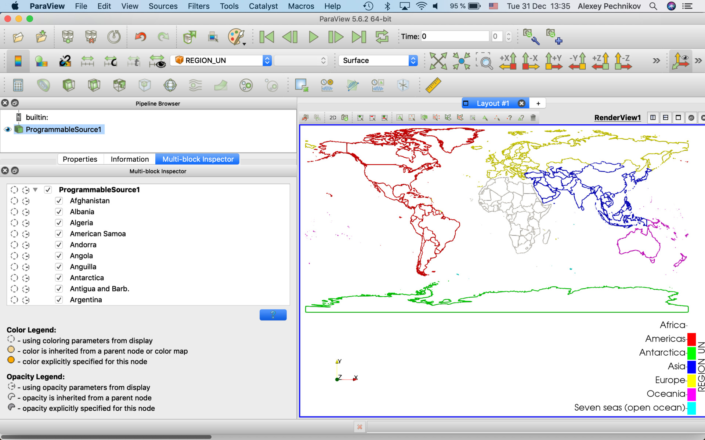

## How to load data into ParaView using it's ProgrammableSource feature

There are some different ways to enhance ParaView features by custom Python code:

1. Use Python console (the best way for one-time commands which are outside of the processing pipeline),
2. Use [Programmable Source](../ProgrammableSource/README.md) (the best way for custom code without pipeline input and the complete processing pipeline),
3. Use [Programmable Filter](../ProgrammableFilter/README.md) (the best way for custom code with pipeline input and the complete processing pipeline),
4. Use Plugins (the best way for well formalized code modules).

Below use explaining the way #2. In this case we use Python code integrated into ParaView processing pipeline without dependencies to other pipeline objects. Way #3 is very similar but it depends of other pipeline items.

[Install Python modules](../install.md)

[Prepare data files](../datafiles.md)

[ProgrammableSource vtkTable](vtkTable.md)

[ProgrammableSource vtkMultiblockDataSet](vtkMultiblockDataSet.md)

[ProgrammableSource vtkPolyData](vtkPolyData.md)

[ProgrammableSource vtkImageData](vtkImageData.md)

[References](../references.md)

## Complex scripts

This script can process shapefiles (see http://www.naturalearthdata.com for example) to ParaView vtkMultiblockDataSet and vtkPolyData (select the required "Output Data Set Type"). Optional topography raster supported to produce Z coordinates.

[ProgrammableSource vtkMultiBlockDataSet and vtkAppendPolyData for shapefiles](ParaView_ProgrammableSource_geometries.py)

