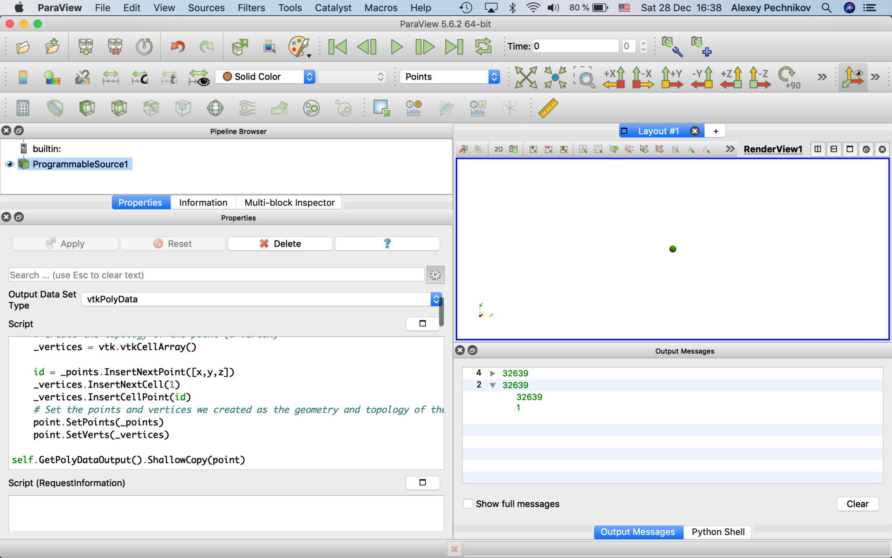

## vtkPolyData

RequestInformation Script is not required for vtkPolyData output.

### vtkPolyData (read EPSG:32639 AOI shapefile and EPSG:32639 topography GeoTIFF and convert only topography for the area to ParaView surface)

#### Script
```
import vtk
import numpy as np
import xarray as xr
import pandas as pd
import geopandas as gpd
import shapely as sp

SHP = "/Users/mbg/Documents/SHP/aoi_cobra.32614.shp"
DEM = "/Users/mbg/Documents/ALOS/ALOS_AW3D30_v1903.subset.32614.30m.tif"

# Load DEM
dem = xr.open_rasterio(DEM)
epsg = int(dem.crs.split(':')[1])
print (epsg)

# Load shapefile
shp = gpd.read_file(SHP)

# Reproject if needed
if shp.crs == {}:
    # coordinate system is not defined, use WGS84 as default
    shp.crs = {'init': 'epsg:4326'}
shp['geometry'] = shp['geometry'].to_crs(epsg=epsg)

# calculate 1st geometry extent
(minx, miny, maxx, maxy) = shp.loc[0,'geometry'].bounds
# create raster dataframe for the geometry extent only
df = dem.sel(x=slice(minx,maxx),y=slice(maxy,miny)).to_dataframe('z').reset_index()[['x','y','z']]

# create geodataframe from the raster
geometry = [sp.geometry.Point(x,y) for x,y in zip(df.x,df.y)]
gdf = gpd.GeoDataFrame([], crs=dem.crs, geometry=geometry)
# crop the raster geodataframe by the exact 1st geometry
df = df[gdf.intersects(shp.loc[0,'geometry'])]

points = vtk.vtkPoints()
for row in df.itertuples():
    points.InsertNextPoint(row.x, row.y, row.z)

aPolyData = vtk.vtkPolyData()
aPolyData.SetPoints(points)
aCellArray = vtk.vtkCellArray()
boundary = vtk.vtkPolyData()
print ("boundary",boundary)
boundary.SetPoints(aPolyData.GetPoints())
boundary.SetPolys(aCellArray)
delaunay = vtk.vtkDelaunay2D()
delaunay.SetTolerance(0.001)
delaunay.SetInputData(aPolyData)
delaunay.SetSourceData(boundary)

delaunay.Update()

outputPolyData = delaunay.GetOutput()
array = vtk.vtkFloatArray()
array.SetName("z");
for i in range(0, outputPolyData.GetNumberOfPoints()):
    array.InsertNextValue(outputPolyData.GetPoint(i)[2])
outputPolyData.GetPointData().SetScalars(array)

self.GetPolyDataOutput().ShallowCopy(outputPolyData)
```


### vtkPolyData (read EPSG:32639 topography GeoTIFF and convert to ParaView surface)

#### Script
```
import vtk
import numpy as np
import xarray as xr
import pandas as pd

DEM = "/Users/mbg/Documents/ALOS/ALOS_AW3D30_v1903.subset.32614.30m.tif"

dem = xr.open_rasterio(DEM)
epsg = int(dem.crs.split(':')[1])
print (epsg)

# create input points from raster pixels
df = dem.to_dataframe(name='z').reset_index()
points = vtk.vtkPoints()
for row in df.itertuples():
    points.InsertNextPoint(row.x, row.y, row.z)

# create 2D Delaunay triangulation of input points
aPolyData = vtk.vtkPolyData()
aPolyData.SetPoints(points)
aCellArray = vtk.vtkCellArray()
boundary = vtk.vtkPolyData()
print ("boundary",boundary)
boundary.SetPoints(aPolyData.GetPoints())
boundary.SetPolys(aCellArray)
delaunay = vtk.vtkDelaunay2D()
delaunay.SetTolerance(0.001)
delaunay.SetInputData(aPolyData)
delaunay.SetSourceData(boundary)

delaunay.Update()

# add z coordinates
outputPolyData = delaunay.GetOutput()
array = vtk.vtkFloatArray()
array.SetName("z");
for i in range(0, outputPolyData.GetNumberOfPoints()):
    array.InsertNextValue(outputPolyData.GetPoint(i)[2])
outputPolyData.GetPointData().SetScalars(array)

self.GetPolyDataOutput().ShallowCopy(outputPolyData)
```


### vtkPolyData (read WGS84 volcano Shapefile and EPSG:32639 topography GeoTIFF)

#### Script
```
import vtk
import xarray as xr
import geopandas as gpd

SHP = "/Users/mbg/Documents/volcano/Damavand.shp"
DEM = "/Users/mbg/Documents/GEBCO_2019/GEBCO_2019.subset.32639.0.5km.tif"

dem = xr.open_rasterio(DEM)
epsg = int(dem.crs.split(':')[1])
print (epsg)

shp = gpd.read_file(SHP)
print (len(shp), shp.crs)

# Reproject if needed
if shp.crs == {}:
    # coordinate system is not defined, use WGS84 as default
    shp.crs = {'init': 'epsg:4326'}
shp['geometry'] = shp['geometry'].to_crs(epsg=epsg)

# Create a polydata object
point = vtk.vtkPolyData()

for rowidx, row in shp.reset_index().iterrows():
    geom = row.geometry

    x = geom.x
    y = geom.y
    z = float(dem.sel(x=x,y=y,method='nearest'))

    # Create the geometry of a point (the coordinate)
    _points = vtk.vtkPoints()
    # Create the topology of the point (a vertex)
    _vertices = vtk.vtkCellArray()
    
    id = _points.InsertNextPoint([x,y,z])
    _vertices.InsertNextCell(1)
    _vertices.InsertCellPoint(id)
    # Set the points and vertices we created as the geometry and topology of the polydata
    point.SetPoints(_points)
    point.SetVerts(_vertices)

self.GetPolyDataOutput().ShallowCopy(point)
```

