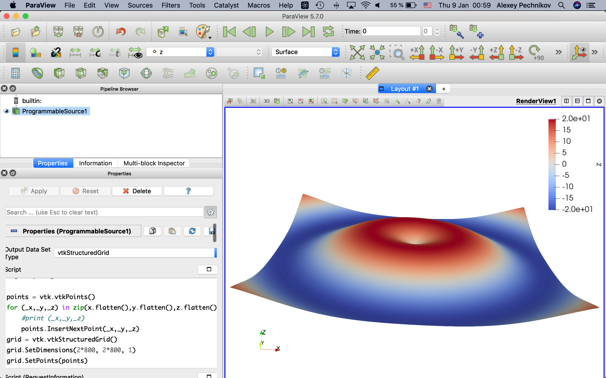

## vtkStructuredGrid

#### Script (RequestInformation)
```
from paraview import util

pdi = self.GetOutput()
extent = pdi.GetExtent()
util.SetOutputWholeExtent(self, extent)
```

### vtkStructuredGrid (pre-defined data and based on "numpy_support" helper library)

#### Script
```
import vtk
from vtk.util import numpy_support as vn 
import numpy as np

# Make data
x = np.arange(-200, 200, 0.25)
y = np.arange(-200, 200, 0.25)
x, y = np.meshgrid(x, y)
r = np.sqrt(x ** 2 + y ** 2)
z = 20*np.sin(r/40)

#z[:400,:400] = 100

vtk_points = vtk.vtkPoints()
points = np.column_stack((x.flatten(),y.flatten(),z.flatten()))
_points = vn.numpy_to_vtk(points, deep=True)
vtk_points.SetData(_points)

grid = vtk.vtkStructuredGrid()
grid.SetDimensions(2*800, 2*800, 1)
grid.SetPoints(vtk_points)

array = vn.numpy_to_vtk(z.ravel(), deep=True, array_type=vtk.VTK_DOUBLE)
grid.GetPointData().AddArray(array)
array.SetName("z")

self.GetStructuredGridOutput().ShallowCopy(grid)
```

### vtkStructuredGrid (pre-defined data)

#### Script
```
import vtk
import numpy as np

# Make data
x = np.arange(-200, 200, 0.25)
y = np.arange(-200, 200, 0.25)
x, y = np.meshgrid(x, y)
r = np.sqrt(x ** 2 + y ** 2)
z = 20*np.sin(r/40)

#z[:400,:400] = 100

points = vtk.vtkPoints()
for (_x,_y,_z) in zip(x.flatten(),y.flatten(),z.flatten()):
	  #print (_x,_y,_z)
    points.InsertNextPoint(_x,_y,_z)
grid = vtk.vtkStructuredGrid()
grid.SetDimensions(2*800, 2*800, 1)
grid.SetPoints(points)

array = vtk.vtkDoubleArray()
array.SetNumberOfComponents(1) # this is 3 for a vector
array.SetNumberOfTuples(grid.GetNumberOfPoints())
for i in range(grid.GetNumberOfPoints()):
    array.SetValue(i, z.ravel()[i])
grid.GetPointData().AddArray(array)
# print grid.GetPointData().GetNumberOfArrays()
array.SetName("z")

self.GetStructuredGridOutput().ShallowCopy(grid)
```


