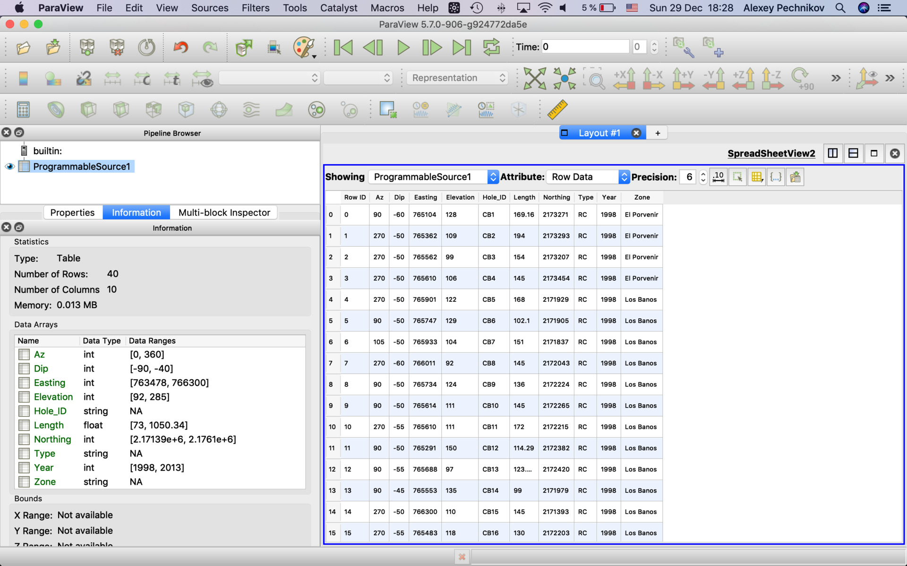
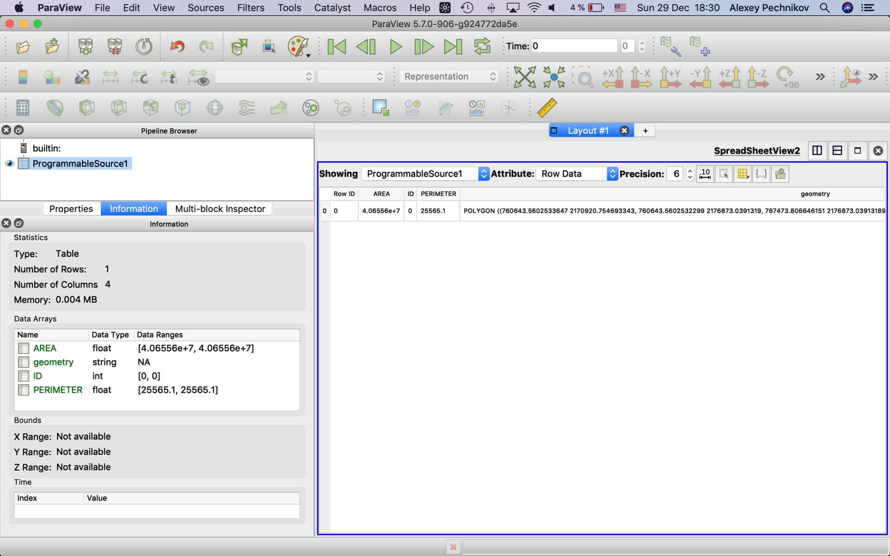

## vtkTable

RequestInformation Script is not required for vtkMultiblockDataSet output.

### vtkTable (read attributes table from drill locations CSV, Microsoft Excel, JSON, etc.)

ParaView provides it's CSV reader what is nice usually. But sometimes we need to define file encoding or limit too long lines, etc. In those cases we need to make our custom CSV reader instead. Also this reader is basic for other readers. See the complete list of supported data formats by the Pandas library:

https://pandas.pydata.org/pandas-docs/version/0.16/io.html
```
read_csv
read_excel
read_hdf
read_sql
read_json
read_msgpack (experimental)
read_html
read_gbq (experimental)
read_stata
read_clipboard
read_pickle
```
To read data from Microsoft Excel we just need to replace "read_csv" function to "read_excel" and so on. 

#### Script
```
import vtk
import numpy as np
import pandas as pd

ENCODING = 'utf-8'
ENCODING = None

STRING_LENGTH_LIMIT = 255

DELIMITER = ','

CSV = "/Users/mbg/Documents/WELLS/Appendix 1 - El Cobre Property Drill Hole Locations.csv"

# read datafile and rename columns to easy use
df = pd.read_csv(CSV, encoding=ENCODING, sep=DELIMITER)
# convert columns to numeric when possible
df = df.apply(pd.to_numeric, errors='ignore')

# vtkTable
vtk_table = self.GetOutput()

# Create columns
for colname in df.columns:
    dtype = df[colname].dtype
    print (colname, dtype)
    if dtype in ['O','str','datetime64']:
        vtk_arr = vtk.vtkStringArray()
    elif dtype in ['int64']:
        vtk_arr = vtk.vtkIntArray()
    elif dtype in ['float64']:
        vtk_arr = vtk.vtkFloatArray()
    elif dtype in ['bool']:
        vtk_arr = vtk.vtkBitArray()
    else:
        print ('Unknown Pandas column type', dtype)
        vtk_arr = vtk.vtkStringArray()
    vtk_arr.SetName(colname)
    for val in df[colname]:
        # some different datatypes could be saved as strings
        if isinstance(vtk_arr, vtk.vtkStringArray):
            val = str(val)
            # crop too long strings
            if len(val) > STRING_LENGTH_LIMIT:
                val = val[:STRING_LENGTH_LIMIT-4] + ' ...'
        vtk_arr.InsertNextValue(val)
    vtk_table.AddColumn(vtk_arr)
```


### vtkTable (read attributes table from AOI Shapefile, dBase, GeoJSON, GPX, DXF, MapInfo File, etc.)

This reader is based on our CSV reader where "pandas" library replaced by "geopandas" to read many GIS vector data formats.
See the full list of supported formats as
```
import fiona; fiona.supported_drivers

'ESRI Shapefile'
'OpenFileGDB'
'SUA'
'ARCGEN'
'GeoJSON'
'GPKG'
'Idrisi'
'GPX'
'SEGY'
'BNA'
'AeronavFAA'
'GPSTrackMaker'
'DGN'
'PCIDSK'
'MapInfo File'
'DXF'
```
Also it reads separate dBase (.dbf) files too.

Use the reader only for attributes data and to visually check geometry fields text representation. 

#### Script
```
import vtk
import numpy as np
import pandas as pd
import geopandas as gpd

ENCODING = 'utf-8'
ENCODING = None

STRING_LENGTH_LIMIT = 255

FILE = "/Users/mbg/Documents/SHP/aoi_cobra.32614.shp"
# that's the same when we have the complete shapefile
#FILE = "/Users/mbg/Documents/SHP/aoi_cobra.32614.dbf"

# read datafile and rename columns to easy use
df = gpd.read_file(FILE, encoding=ENCODING)
# convert columns to numeric when possible
df = df.apply(pd.to_numeric, errors='ignore')
#print (df)

# vtkTable
vtk_table = self.GetOutput()

# Create columns
for colname in df.columns:
    dtype = df[colname].dtype
    print (colname, dtype)
    if dtype in ['O','str','datetime64']:
        vtk_arr = vtk.vtkStringArray()
    elif dtype in ['int64']:
        vtk_arr = vtk.vtkIntArray()
    elif dtype in ['float64']:
        vtk_arr = vtk.vtkFloatArray()
    elif dtype in ['bool']:
        vtk_arr = vtk.vtkBitArray()
    else:
        print ('Unknown Pandas column type', dtype)
        vtk_arr = vtk.vtkStringArray()
    vtk_arr.SetName(colname)
    for val in df[colname]:
        # some different datatypes could be saved as strings
        if isinstance(vtk_arr, vtk.vtkStringArray):
            val = str(val)
            # crop too long strings
            if len(val) > STRING_LENGTH_LIMIT:
                val = val[:STRING_LENGTH_LIMIT-4] + ' ...'
        vtk_arr.InsertNextValue(val)
    vtk_table.AddColumn(vtk_arr)
```

