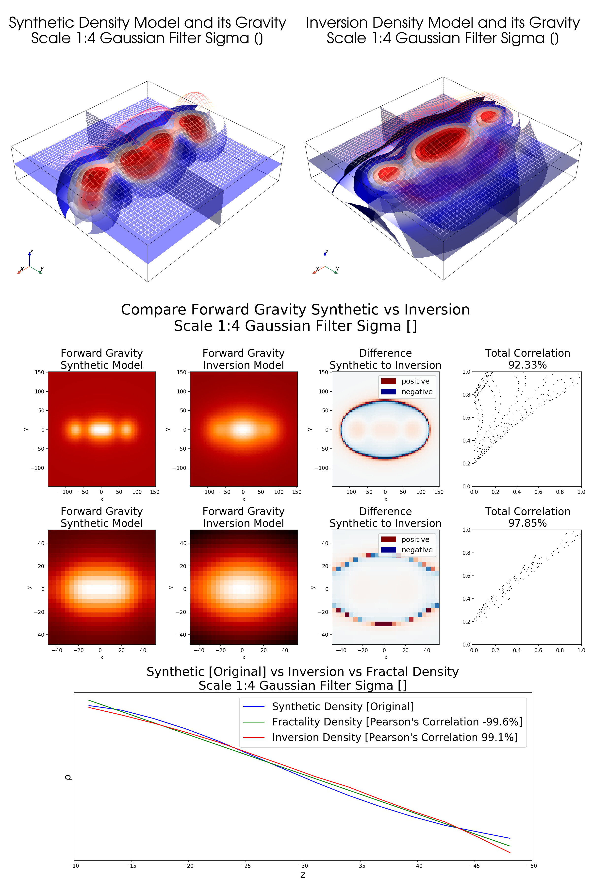

## 3D Density Inversion by Circular Hough Transform [Focal Average] and Fractality Index

Geophysical density inversion based on Circular Hough Transform (also known as Focal Average in GIS packages
like to ESRI products) and Fractality Index calculated by discrete spatial power spectrum of gravity on synthetic model [basic.ipynb](basic.ipynb) The model also includes source gravity grid decimation to estimate the accuracy for real-world gravity grids processing.

