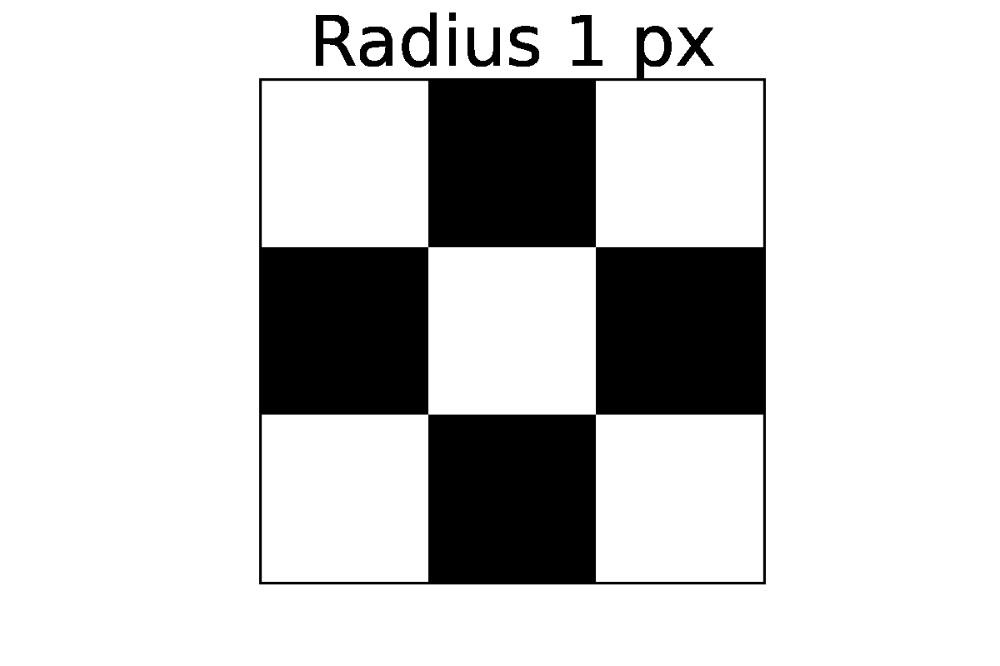

## Focal statistics processing library geomed3dv4.py



The python script collects some helpful functions for VTK files export by numpy only and geo data processing and analysis. Also, it's wrapper for binary C coded library **libgeomed3dv4.so** which can be compiled from the sources by script [geomed3dv4.sh](geomed3dv4.sh) **focal** binary is test tool for the binary library to print the focal mask generating by the library. Use [focal.sh](focal.sh) to compile and [focal.ipynb](focal.ipynb) to visualize the output.

Load the Python extension:
```
from geomed3dv4 import *
```

and if needed load the binary extension:
```
import ctypes
lib = ctypes.cdll.LoadLibrary('libgeomed3dv4.so')
```

Use the library for focal calculation:
```
ds3d = geomed(lib, raster_dataarray, grid_dataframe, radius_min, radius_max, gridded=True)
```
where function **geomed** returns Xarray DataSet for the input arguments. Here "lib" is library handler loaded above, "raster_dataarray" is image opened by xarray.open_rasterio() function, "grid_dataframe" is dataframe for processing points, "radius_min" and "radius_max" define processing radiuses and "gridded" flag allows to convert output into 3D data cube. 

We have been used the libraries for many years to generate some complex statistics on big rasters (which are cropped from the shared code). For now, we've rewritten the code in Python using Numba + Dask for easy usage in Amazon and Google clouds, giving identical performance to the native code. The extension could be a great example of Python + C libraries interaction. 

## Old focal statistics processing library geomed3dv3.py

Old library version 3 [geomed3dv3.py](geomed3dv3.py) provides some helpful functions to open raster and vector files by GDAL, produce ASCII or GeoTIFF files from Xarray DataSets, save datasets to PostgreSQL/PostGIS and so on. For now, that's easier to use Xarray+RasterIO and GeoPandas to do.
